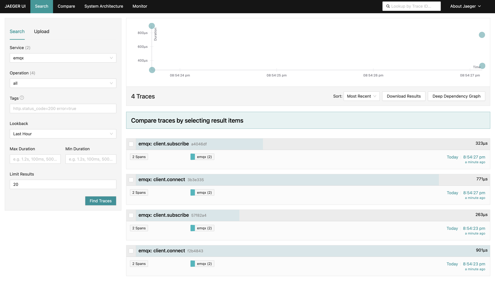
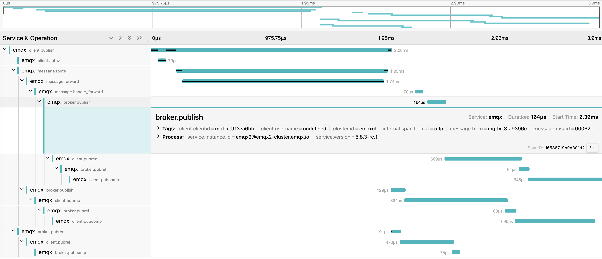

# 基于 OpenTelemetry 的 MQTT 端到端追踪

::: tip

仅 EMQX 5.8.3 及以上版本支持 **端到端追踪** 功能。

:::

## 设置 OpenTelemetry Collector

请参考 [设置 OpenTelemetry Collector](./traces.md#设置-OpenTelemetry-Collector)。

## 在 EMQX 中启用端到端追踪

本节指导您如何在 EMQX 中启用基于 OpenTelemetry 的端到端追踪，展示多节点设置中的 MQTT 分布式追踪能力。

你也可以在 Dashboard **管理** -> **监控** 页面下的 **监控集成** 选项卡中配置 OpenTelemetry 端到端追踪集成。

1. 将以下配置添加到 EMQX `cluster.hocon` 文件中（假设 EMQX 在本地机器上运行）：

   对于更多配置项含义及说明，您可以参考 [EMQX Dashboard 监控集成](http://localhost:18083/#/monitoring/integration) 的 OpenTelemetry 子选项卡。

   ```bash
   opentelemetry {
     exporter { endpoint = "http://localhost:4317" }
     traces {
      enable = true
      # 端到端追踪模式
      trace_mode = e2e
      # 端到端追踪选项
      e2e_tracing_options {
        ## 是否追踪客户端连接/断开事件
        client_connect_disconnect = true
        ## 是否追踪客户端消息事件
        client_messaging = true
        ## 是否追踪客户端订阅/取消订阅事件
        client_subscribe_unsubscribe = true
        ## 客户端ID 白名单最大长度
        clientid_match_rules_max = 30
        ## 主题过滤器白名单最大长度
        topic_match_rules_max = 30
        ## 集群标识符
        cluster_identifier = emqxcl
        ## 消息追踪等级（QoS）
        msg_trace_level = 2
        ## 采样率，即除白名单以外追踪事件的采样率
        ## Note: 仅当追踪事件开启时才根据采样率进行采样
        sample_ratio = "100%"
       }
     }
     max_queue_size = 50000
     scheduled_delay = 1000
    }
   }
   ```

2. 启动 EMQX 节点，例如，以节点名 `emqx@172.19.0.2` 和 `emqx@172.19.0.3` 启动一个有两个节点的集群，以展示分布式追踪功能。

3. 使用 [MQTTX CLI](https://mqttx.app/zh/cli) 作为客户端在不同节点上订阅相同主题。

   - 在 `emqx@172.19.0.2` 节点上订阅：

     ```bash
     mqttx sub -t t/1 -h 172.19.0.2 -p 1883
     ```

   - 在 `emqx@172.19.0.3` 节点上订阅：

     ```bash
     mqttx sub -t t/1 -h 172.19.0.3 -p 1883
     ```

4. 大约 5 秒后（EMQX 导出追踪数据的默认间隔），导航到 [http://localhost:16686](http://localhost:16686/) 的 Jaeger WEB UI 观察追踪数据：

   选择 `emqx` 服务并点击 **查找追踪**。如果 `emqx` 服务没有立即出现，请稍等片刻后刷新页面。您应该看到客户端连接及订阅的事件追踪：

   

5. 发布任意消息：

     ```bash
     mqttx pub -t t/1 -h 172.19.0.2 -p 1883
     ```

6. 等待片刻，您可以在 Jaeger WEB UI 找到 MQTT 消息的详细追踪：

   点击追踪查看详细的跨度信息和追踪时间线，视订阅者多寡、消息路由是否需要跨节点、消息 QoS 、`msg_trace_level` 等配置的不同，一条 MQTT 消息在追踪时间线中可能会具有不等数量的跨度信息。

   以下是在两个客户端均具有 QoS2 级别订阅，消息发布者发布 QoS2 等级的 MQTT 消息，及 `msg_trace_level` 配置为 2 时的追踪时间线及跨度信息。

   特别地，由于客户端 `mqttx_9137a6bb` 与消息发布者连接在不同的 EMQX 节点。在消息投递向该客户端时需要跨节点传输，所以具有两个额外的跨度：`message.forward` 与 `message.handle_forward`。

   

## 管理追踪跨度过载

EMQX 会积累追踪跨度，并定期批量导出它们。 导出间隔由 `opentelemetry.trace.scheduled_delay` 参数控制，默认为 5 秒。 批处理追踪跨度处理器包含过载保护机制，允许只积累到一定限制的跨度，该限制默认为 2048 个跨度。您可以使用以下配置设置此限制：

```yaml
opentelemetry {
  traces {
    max_queue_size = 50000
    scheduled_delay = 1000
  }
}
```

一旦达到 `max_queue_size` 限制，新的追踪跨度将被丢弃，直到当前队列被导出。

::: tip 提示

如果追踪的消息被分发给大量订阅者，或由于消息数量多，采样率较高等因素，预计只有少量跨度会被导出，大多数跨度会因过载保护而被丢弃。

对于端到端追踪模式，应视消息量及采样率增加 `max_queue_size` 值，于此同时也可适当减小 `scheduled_delay` 配置以增加跨度导出频率。从而避险端到端追踪的跨度因过载保护而丢失。

**但需要注意的是，较高的导出频率与较大的导出队列长度，可能会增加系统的资源消耗。您应该启用该功能前对消息 TPS，系统可用资源等受限因素进行适当估计以采取合适的配置。**

:::
